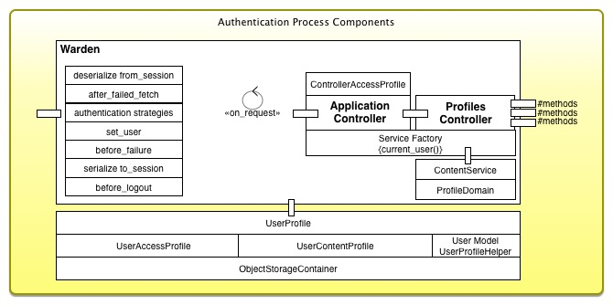
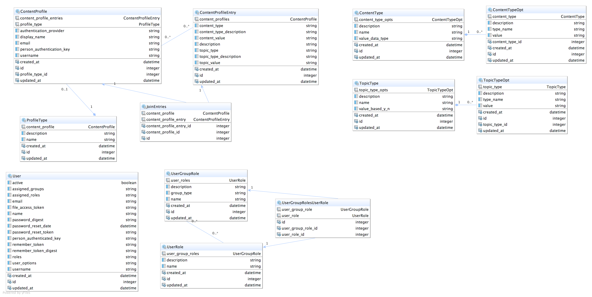

#SknService
---

Author: James Scott
Date: Dec 2015

#Introduction
---

This is a Rails 4.2.5/Ruby 2.2.3/PostgreSQL Application, which demonstrates Authentication and Authorization strategies.  

My original
need was to demonstrate this methodology, rather than to continue open-ended theoretical discussions.  To end the conversations I needed
to create two models, one based on an existing XML file; modeled after Java's Security Manager and permission.  The other model would
be a Database driven model that represented the same goal.  It is my expectation that they both meet my objective, and could both
be used successfully in any application base.  

Of the two strategies the database model is my preference, as it would be easier to create a UI to support it and to maintain as new projects are added. The demonstration
of the final algorithmic result is the 'ContentProfile Demo' page.  It lists all the systems users, and when one is selected it displays
both the XML AccessProfile, and the matching DB ContentProfile.

The algorithm and point being made was: Create a two-factor authorization per user, that precisely identifies the business entities a user is assigned, and precisely identifies the
types of content that user is authorized to interact with; for that specific business entity.

After having proven my point, I've decided to share the body of this work and complete it by implementing my ToDo list, and a formal
Domain Driven Design(DDD) focused on the business of an Audio Engineering (Mixer).  Where collecting and delivering audio project files to 
clients and partners, like mastering engineers, with absolutely tight security is essential.

Again, I've not started the DDD yet, nor finished all the UI.  This I will complete over the next few months.  However, the basic
security and authorization features are fully completed and I think quite usable as a secure starter application.

Note: The initial context of the application was to provide protection of important business documents like commission statements, and capturing
operational attributes like, which states is a branch licensed to quote new business.  I will transition to the new and more formal DDD in the coming weeks.

James,


##Installation
---

You will need to install PostGreSQL, and add/edit PostgreSQL credentials:
 
    config/settings.yml, 
    config/settings/development.yml or create and edit config/settings/development.local.yml
    config/settings/test.yml or create and edit config/settings/test.local.yml
 
It might be helpful to set these environment params too:
    
    export COVERAGE=true
    export JRUBY='--server --debug'
    export BUNDLE_PATH='vendor/bundle'     Note: use of rvm wipes out all these values, you may need to reset them
    
    
The default Ruby for this package is JRuby-9.0.4.0.  If you want to use a different version of ruby; Edit

```Bash

$ vim .ruby-version             # change to 'ruby-2.2.3'

```

    
    
Then execute;
 
```Bash

$ mkdir tmp
$ mkdir log
$ bin/setup
$ rspec

```

    Note: Ruby 2.2.+ is also supported with database adapter change. JRuby 9.0.40.+ is the default 
    Also: db/seeds.rb contains test user credentials
          lib/tasks/profile_tools_task.rake contain creates the initial database version of the content profile.




##Overview
---

This application demonstrates and explores methods for Authentication, Access Authorizations,
and Content Authorizations.  Referred to as UserProfiles, AccessProfiles, and ContentProfiles in
this application.

* UserProfiles deal with userid, password, password resets, and some preferences management.
* AccessProfiles deal with what each user is allowed to access, click, or view.
* ContentProfiles deal with specific content access privileges; which document, etc.
    
UserProfiles and AccessProfiles have many different implementations available, and are well handled processes. The [Java Access Controller](http://www.cs.ait.ac.th/~on/O/oreilly/java-ent/security/ch05_01.htm "Java Access Controller"), and related classes,
 were the original template for the AccessRegistry or AccessProfile capability; This now is an enhanced Ruby port of those permission capabilities. However,
ContentProfiles are the main focus of exploration in this app, which has proven to be a significant 
engineering challenge when it comes to handling the dynamics of Electronic Delivery.  


###Core Idea
---

####ContentProfile and AccessProfile are implementations of the same core idea, with side benefits.  For lack of a better term: ContentProfile is the label adopted to represent that core idea.

In general anything that can be accessed is considered a CONTENT TYPE.  The specific entity that content is related to is considered a
TOPIC TYPE.  Both types must be fully qualified with their respective Identifiers. Once qualified the two are combined into a holding object 
called a Content Profile Entry, and given a descriptive title.

One Content Profile Entry describes one permission, through the combination of a fully qualified content type identifiers and topic type identifiers.  It is expected that a
user's collection would have many of these specialized entries, and that some entries may be shareable (reducing redundancy) with other users.  Entries
are themselves assigned to a wrapper object called a Content Profile which maintains a users unique collection.

Content Profiles are the anchor back to the User Profile, via the person authentication key(PAK) or UUID they rely on as THE primary identifier.


##Objective
---

The system shall offer methods to:

1. Clearly indicate an employee, vendor, manager, customer service representative, or any business ACTORs role!
    * by identifying the person(s) using a permanent and persistent identifier from a trusted authentication source.
2. Ensure user is authenticated and that user has specific access to the requested page, api, and click-ables on that page; unless the target page is public.
    * by using the permission roles assigned to each authenticated user and the Secure::AccessProfile access class.
3. Ensure user is constrained to interact with processes or view information they were specifically authorized for!
    * by identifying the person(s) identifier, and applying their Secure::ContentProfile collection of permissions to control access to both processes and information.
4. Have no hard Rails dependencies, and serve as a technology platform for building secure web applications.
    * Outside of keeping its private tables in AR, it supplies its services independent of Rails.
    * It is assumed that user records and most displayable information is not solely housed locally in Rails; but sourced from external systems or computed.


##AccessProfile i.e (Secure::AccessRegistry)
---
The current implementation of AccessProfile contains an XML Secure::AccessRegistry file which could embody the specific requirements of
the ContentProfile.  It would do this by creating an entry for each content type uri; like:

    URI syntax:
*    Document Access => 'Commission/Branch/0024'
* Process Constraint => 'Quoting/LicensedStates/USA'
*         Operations => 'Notifications/Account/1003'
    
The URI syntax thinking is A/B/C.  Where A is the content(What), B is the entity type(Who), and C is the entity identifier(Who's ID). A <userdata> field contains
the identifiers for A content(What's IDs).  Example: Commission documents for Branch 24, where the list of document type ids is contained in userdata.  

This translates to AccessRegistry XML like the following:

```Xml

<resource secured="true" content="true">
    <uri>Commission/Branch/0024</uri>
    <description>Branch 24 Commision Reports in Imaging System Storage</description>
    <userdata>"drawerid:27655173|filetype:27635476|foldertype:27637844|doctype:[955,956,957]"</userdata>
    <permission type="READ">
        <authorizedRoles>
            <authorizedRole options="0024">ContentProfile.Access.Branch.Commission</authorizedRole>
        </authorizedRoles>
    </permission>
</resource>

<resource secured="true" content="true">
    <uri>Quoting/LicensedStates/USA</uri>
    <description>Licensed to produce Quote in Michigan, Indiana, Ohio, and Illinois</description>
    <userdata>"MI,IN,OH,IL"</userdata>
    <permission type="READ">
        <authorizedRoles>
            <authorizedRole options="PRODUCER,CSR">ContentProfile.Operational.Process.Quoting</authorizedRole>
        </authorizedRoles>
    </permission>
</resource>

<resource secured="true" content="true">
    <uri>Notifications/Account/1003</uri>
    <description>Change Notification for Account 1003</description>
    <userdata>"Payments|Invoices|Cancels|Claims|Approvals"</userdata>
    <permission type="READ">
        <authorizedRoles>
            <authorizedRole options="1003">ContentProfile.Operations.Notifications</authorizedRole>
        </authorizedRoles>
    </permission>
</resource>

```


Each authorizedRole("ContentProfile.Access.Branch.Commission") would be assigned to one or more individuals via the normal assignment method.  With the
 role assigned to a user, and that user having branch '0024' in their 
user profile options, they would be allowed to view/download commission reports for that branch, and all branches in their user profile.  

Implementations of AccessProfile would evaluate these entries when accessing secured content.  Programmatic calls to the AccessProfile will need
to include a user's list of assigned branches (options), and assigned roles for validation of their access privileges. 


###If the permission has options, at least one user options must match! 

This allows for the options attribute array to override the one or more values specified in the URI.  When XML options attribute list all branches for which this 
service is enabled, the user will be required to have at least one option in their profile and the specific authorizedRole.  Below is a bit of the AccessRegistry's ruby methods.


```Ruby

def has_access? (resource_uri, options=nil)
  rc = Secure::AccessRegistry.check_access_permissions?( access_roles_all, resource_uri, options)
  Rails.logger.debug("#{self.class.name}.#{__method__}(#{rc ? 'True':'False'}) #{resource_uri} #{options}")
  rc
end

def has_create? (resource_uri, options=nil)
  Secure::AccessRegistry.check_role_permissions?( access_roles_all, resource_uri, "CREATE", options)
end
def has_read? (resource_uri, options=nil)
  Secure::AccessRegistry.check_role_permissions?( access_roles_all, resource_uri, "READ", options)
end
def has_update? (resource_uri, options=nil)
  Secure::AccessRegistry.check_role_permissions?( access_roles_all, resource_uri, "UPDATE", options)
end
def has_delete? (resource_uri, options=nil)
  Secure::AccessRegistry.check_role_permissions?( access_roles_all, resource_uri, "DELETE", options)
end

def get_resource_description(resource_uri)
  Secure::AccessRegistry.get_resource_description(resource_uri)
end
def get_resource_userdata(resource_uri)
  Secure::AccessRegistry.get_resource_userdata(resource_uri)
end
def get_resource_content_entries(opt=nil)
  opts = opt || self[:user_options] || nil
  Secure::AccessRegistry.get_resource_content_entries(self[:roles], opts)
end
def get_resource_content_entry(resource_uri, opt=nil)
  opts = opt || self[:user_options] || nil
  Secure::AccessRegistry.get_resource_content_entry(self[:roles], resource_uri,  opts)
end

```

    AccessControl API Examples: 
      hash_result = get_resource_content_entries(user_object.branches)
      hash_result = get_resource_content_entry("Commission/Branch/0024", user_object.branches)
      
      hash_result has been standardized to be same as alternate database method being proposed.


##ContentProfile (i.e. The preferred Approach )
---

Preferred as in reference to getting the job done.  We could implement both the xml and the db strategies.  XML version for program assets, DB for business information and processes.  But I need to be clear we can use either strategy.


An alternate approach would be to use a specifically implemented ContentProfile. Capable of encoding
a persons privileges across a reasonable spectrum of content types.  This can be accomplished with
about eight data tables, and a admin ui.   Both approaches require programmatic extension to AccessProfile
to evaluate a users access to a specific bit of content.  

This is where we begin.


## Full Application Data Model
---




##Todos
---

1. Create a Authorizing Menu Manager View Class
    * Should Authorize a full menu, removing non-authorized items at Warden's :after_authentication callback
    * Cache itself to Session or ObjectStore via Controller before_action/After_action
    * Have a flexible initialization Hash, that specifies all levels including submenus
2. Create a PageAction Class View Class: DONE 1/20/2016
    * Should generate on-demand based on presence of :page_actions key's presence in @page_controls
    * Should handle sub-menus, headers, icons, and dividers.
    * Should resolve router path and url symbols, with all options (:id, :text:, and :html_options)
    * Sub-menus should be hover sensitive
3. Create ContentProfile Creation Screen
    * Allow creation of full profiles, or components as needed.
4. Refactor Rails Controllers into Domain/Service model for Users, UserGroups, and UserRoles
    * Simular to ContentProfile tables
5. Write AccessRegistry XML Class to CRUD xml entries
6. Write ContentProfile Executor
    * to render results from 'controlled' directory to demo assessable table
7. Review and update text top level pages, also improve their structure
8. Complete design guidance page
9. Roll application into a Rails Engine for delivery
10. Upgrade to Rails 5.0
11. Implement Warble War for Tomcat Execution
12. Consider a Rack UnAuthenticated Application for repeated violations.
13. Build a Registration Feature to enroll user locally.
    * Presume user does not exist
    * Capture or generate a PAK
    * Assign default Public Groups
    * Assign default ContentProfile
    * Create Local User record
    * Email user a ChangePassword to complete registration

    
    
##License
---

The MIT License (MIT)

Copyright (c) 2016 James Scott, Jr.

Permission is hereby granted, free of charge, to any person obtaining a copy of this software and associated documentation files (the "Software"), to deal in the Software without restriction, including without limitation the rights to use, copy, modify, merge, publish, distribute, sublicense, and/or sell copies of the Software, and to permit persons to whom the Software is furnished to do so, subject to the following conditions:

The above copyright notice and this permission notice shall be included in all copies or substantial portions of the Software.

THE SOFTWARE IS PROVIDED "AS IS", WITHOUT WARRANTY OF ANY KIND, EXPRESS OR IMPLIED, INCLUDING BUT NOT LIMITED TO THE WARRANTIES OF MERCHANTABILITY, FITNESS FOR A PARTICULAR PURPOSE AND NONINFRINGEMENT. IN NO EVENT SHALL THE AUTHORS OR COPYRIGHT HOLDERS BE LIABLE FOR ANY CLAIM, DAMAGES OR OTHER LIABILITY, WHETHER IN AN ACTION OF CONTRACT, TORT OR OTHERWISE, ARISING FROM, OUT OF OR IN CONNECTION WITH THE SOFTWARE OR THE USE OR OTHER DEALINGS IN THE SOFTWARE.
   
