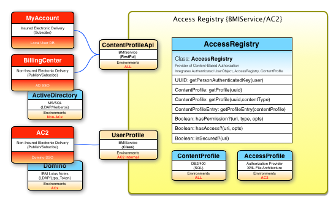
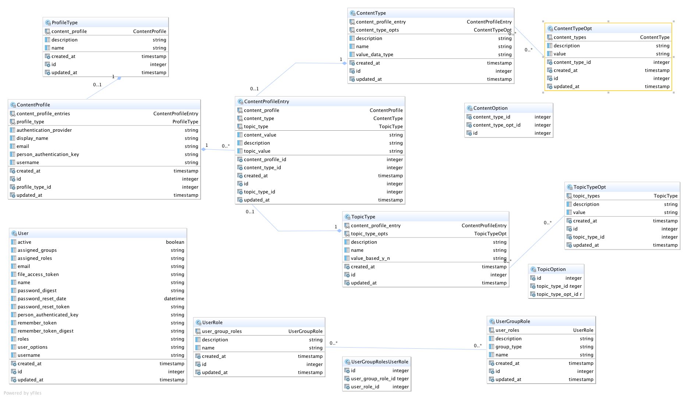

#Sknservice
---

This application demonstrates and explores methods for Authentication, Access Authorizations,
and Content Authorizations.  Referred to as UserProfiles, AccessProfiles, and ContentProfiles in
this application.

* UserProfiles deal with userid, password, password resets, and some preferences management.
* AccessProfiles deal with what each user is allowed to access, click, or view.
* ContentProfiles deal with specific content access priviledges; which document, etc.
    
UserProfiles and AccessProfiles have many different implementations available, and are well handled processes.  However,
ContentProfiles are the main focus of exploration in this app, which has proven to be a significant 
engineering challenge to handle the dynamics of Electronic Delivery.  

AccessProfile i.e (Secure::AccessRegistry)
---

The current implementation of
AccessProfile contains an XML Secure::AccessRegistry file which could embody the specific requirements of
the ContentProfile.  It would do this by creating an entry for each content type uri; like:

* 'Agency/Commission-STMT/0034'
* 'Agency/Commission-CSV/0034'
* 'Agency/Experience-STMT/0034'
* 'Agency/Commission-STMT/1003'
* 'Agency/Commission-CSV/1003'
* 'Agency/Experience-STMT/1003'
    
The above would need to be repeated for each agency, and content type. Security roles for administrating
who has access to each URI will need to be created.  Something like:

```Xml

<resource secured="true">
    <uri>Agency/Commission-STMT/0034</uri>
    <description>Agency Commision Report in ImageRight</description>
    <userdata>{"drawerid":"27655173","filetype":"27635476","foldertype":"27637844","doctype":"955"}</userdata>
    <permission type="READ">
        <authorizedRoles>
            <authorizedRole options="0034">ContentProfile.Access.Agency.Commission-STMT</authorizedRole>
        </authorizedRoles>
    </permission>
</resource>
<resource secured="true">
    <uri>Agency/Commission-CSV/0034</uri>
    <description>Agency Commision Report in csv format from ImageRight</description>
    <userdata>{"drawerid":"27655173","filetype":"27635476","foldertype":"27637844","doctype":"955"}</userdata>
    <permission type="READ">
        <authorizedRoles>
            <authorizedRole options="0034">ContentProfile.Access.Agency.Commission-CSV</authorizedRole>
        </authorizedRoles>
    </permission>
</resource>
<resource secured="true">
    <uri>Agency/Experience-STMT/0034</uri>
    <description>Agency Experience Report in ImageRight</description>
    <userdata>{"drawerid":"27655173","filetype":"27635476","foldertype":"27637844","doctype":"955"}</userdata>
    <permission type="READ">
        <authorizedRoles>
            <authorizedRole options="0034">ContentProfile.Access.Agency.Experience-STMT</authorizedRole>
        </authorizedRoles>
    </permission>
</resource>

```

Each role would be assigned to one or more individuals via the normal assignment method, Domino in our case.  With the
'ContentProfile.Access.Agency.Commission-RPT' role assigned to a user, and that user having agency '0034' in their 
user profile, they would be allowed to view/download commission reports for that agency, and all agency in their user profile.  

Implementations of AccessProfile would be extended to 
evaluate these entries when accessing secured content.  Programmatic calls to the AccessProfile will need
to include a user's list of assigned agencies for validation of their access privileges. 

    AccessControl API Examples: 
      boolean_result = AccessProfile.has_access?(user.roles, "Agency/Commission-STMT/0034", user_object.agencies)
      hash_result    = AccessProfile.get_userdata("Agency/Commission-STMT/0034")

##ContentProfile
---



An alternate approach would be to use a specifically implemented ContentProfile. Capable of encoding
a persons privileges accross a reasonable spectrum of content types.  This can be accomplished with
about eight data tables, and a admin ui.   Both approaches require programmatic extension to AccessProfile
to evaluate a users access to a specific bit of content.  

This is where we begin.


## Full Application Data Model


