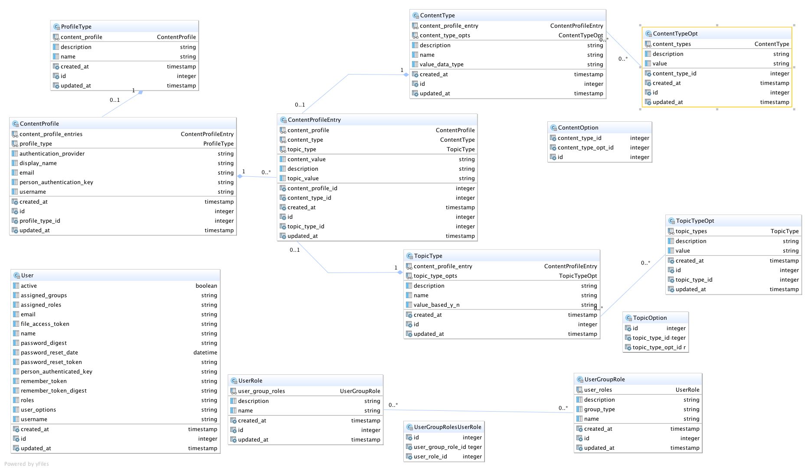

#AuthService
---

Author: James Scott <jscott@brotherhoodmutual.com>
Date: Dec 2015


##Installation
---

You will need to install PostGreSQL, and add/edit database credentials:
 
    config/settings.yml, 
    config/settings/development.yml or create and edit config/settings/development.local.yml
    config/settings/test.yml or create and edit config/settings/test.local.yml
 
It might be helpful to set these environment parms too:
    
    export COVERAGE=true
    export JRUBY='--server --debug'
    export BUNDLE_PATH='vendor/bundle'
    
Then execute;
 
```Bash

$ bin/setup
$ rspec

```


##Overview
---

This application demonstrates and explores methods for Authentication, Access Authorizations,
and Content Authorizations.  Referred to as UserProfiles, AccessProfiles, and ContentProfiles in
this application.

* UserProfiles deal with userid, password, password resets, and some preferences management.
* AccessProfiles deal with what each user is allowed to access, click, or view.
* ContentProfiles deal with specific content access privileges; which document, etc.
    
UserProfiles and AccessProfiles have many different implementations available, and are well handled processes. The [Java Access Controller](http://www.cs.ait.ac.th/~on/O/oreilly/java-ent/security/ch05_01.htm "Java Access Controller"), and related classes,
 were the original template for the AccessRegistry or AccessProfile capability; This now is an enhanced Ruby port of those permission capabilities. However,
ContentProfiles are the main focus of exploration in this app, which has proven to be a significant 
engineering challenge when it comes to handling the dynamics of Electronic Delivery.  


##Objective
---

The system shall contribute to resolving these initial use cases:

1. Clearly indicate an employee, agent, agency owner, CSR, or any business ACTOR role!
    * by identifying the person(s) using a permanent and persistent identifier from an authenticated source.
2. When an Insured enrolls in 'DirectPay' what additional documents have they chosen to have delivered electronically to them?
    * by identifying the person(s), and encoding which person is authorized to view specific electronic documents.
3. Who has an AgencyOwner authorized to receive and/or view their monthly Commission Statement, Commission CSV File, and Agency Experience Report?
    * by identifying the person(s), and encoding which person is authorized to view specific electronic documents.
4. When a Policy changes its LifeCycle Status, who receives notification; and how should that notification be sent?
    * by identifying the person(s), and encoding which person is authorized to receive notifications by type, where type includes the delivery method.


##AccessProfile i.e (Secure::AccessRegistry)
---
The current implementation of AccessProfile contains an XML Secure::AccessRegistry file which could embody the specific requirements of
the ContentProfile.  It would do this by creating an entry for each content type uri; like:

* 'Agency/Commission-STMT/0034'
* 'Agency/Commission-CSV/0034'
* 'Agency/Experience-STMT/0034'
* 'Agency/Commission-STMT/1003'
* 'Agency/Commission-CSV/1003'
* 'Agency/Experience-STMT/1003'
    
The syntax thinking is A/B/C.  Where A is the topic, B is the action, and C is the topic identifier. A <userdata> contains
the identifiers for B action.  The would need to be coded and repeated for each agency, and content type. Security roles for administrating
who has access to each URI will need to be created.  Something like:


```Xml

<resource secured="true">
    <uri>Agency/Commission-STMT/0034</uri>
    <description>Agency Commision Report in ImageRight</description>
    <userdata>"drawerid:27655173|filetype:27635476|foldertype:27637844|doctype:955"</userdata>
    <permission type="READ">
        <authorizedRoles>
            <authorizedRole options="0034">ContentProfile.Access.Agency.Commission-STMT</authorizedRole>
        </authorizedRoles>
    </permission>
</resource>

<resource secured="true">
    <uri>Agency/Commission-CSV/0034</uri>
    <description>Agency Commision Report in csv format from ImageRight</description>
    <userdata>"drawerid:27655173|filetype:27635476|foldertype:27637844|doctype:955"</userdata>
    <permission type="READ">
        <authorizedRoles>
            <authorizedRole options="0034">ContentProfile.Access.Agency.Commission-CSV</authorizedRole>
        </authorizedRoles>
    </permission>
</resource>

<resource secured="true">
    <uri>Agency/Experience-STMT/0034</uri>
    <description>Agency Experience Report in ImageRight</description>
    <userdata>"drawerid:27655173|filetype:27635476|foldertype:27637844|doctype:955"</userdata>
    <permission type="READ">
        <authorizedRoles>
            <authorizedRole options="0034">ContentProfile.Access.Agency.Experience-STMT</authorizedRole>
        </authorizedRoles>
    </permission>
</resource>

```


###With a minor modification, listing all agencies in the Options, we can reduce the total number of records.


```Xml

<!--============== Content Access Adaptation  ========== -->

<resource secured="true" content="true">
    <uri>Commission/Agency/PDF</uri>
    <description>Agency Commission Statements</description>
    <userdata>"doctype:954"</userdata>
    <permission type="READ">
        <authorizedRoles>
            <authorizedRole options="0034,0037,0040">Test.Agency.Commission.Statement.PDF.Access</authorizedRole>
        </authorizedRoles>
    </permission>
</resource>

<resource secured="true" content="true">
    <uri>Commission/Agency/CSV</uri>
    <description>Agency Commission CSV Datafiles</description>
    <userdata>"doctype:955"</userdata>
    <permission type="READ">
        <authorizedRoles>
            <authorizedRole options="0034,0037,0040">Test.Agency.Commission.Statement.CSV.Access</authorizedRole>
        </authorizedRoles>
    </permission>
</resource>

<resource secured="true" content="true">
    <uri>Experience/Agency/PDF</uri>
    <description>Agency Experience Statements</description>
    <userdata>"doctype:956"</userdata>
    <permission type="READ">
        <authorizedRoles>
            <authorizedRole options="0034,0037,0040">Test.Agency.Commission.Experience.PDF.Access</authorizedRole>
        </authorizedRoles>
    </permission>
</resource>

```


Each role would be assigned to one or more individuals via the normal assignment method, Domino in our case.  With the
 role assigned to a user, and that user having agency '0034' in their 
user profile options, they would be allowed to view/download commission reports for that agency, and all agency in their user profile.  

Implementations of AccessProfile would be extended to 
evaluate these entries when accessing secured content.  Programmatic calls to the AccessProfile will need
to include a user's list of assigned agencies (options) for validation of their access privileges. 


###If the permission has options, at least one user options must match!


```Ruby

def has_access? (resource_uri, options=nil)
  rc = Secure::AccessRegistry.check_access_permissions?( access_roles_all, resource_uri, options)
  Rails.logger.debug("#{self.class.name}.#{__method__}(#{rc ? 'True':'False'}) #{resource_uri} #{options}")
  rc
end

def has_create? (resource_uri, options=nil)
  Secure::AccessRegistry.check_role_permissions?( access_roles_all, resource_uri, "CREATE", options)
end
def has_read? (resource_uri, options=nil)
  Secure::AccessRegistry.check_role_permissions?( access_roles_all, resource_uri, "READ", options)
end
def has_update? (resource_uri, options=nil)
  Secure::AccessRegistry.check_role_permissions?( access_roles_all, resource_uri, "UPDATE", options)
end
def has_delete? (resource_uri, options=nil)
  Secure::AccessRegistry.check_role_permissions?( access_roles_all, resource_uri, "DELETE", options)
end

def get_resource_description(resource_uri)
  Secure::AccessRegistry.get_resource_description(resource_uri)
end
def get_resource_userdata(resource_uri)
  Secure::AccessRegistry.get_resource_userdata(resource_uri)
end
def get_resource_content_entries(opt=nil)
  opts = opt || self[:user_options] || nil
  Secure::AccessRegistry.get_resource_content_entries(self[:roles], opts)
end
def get_resource_content_entry(resource_uri, opt=nil)
  opts = opt || self[:user_options] || nil
  Secure::AccessRegistry.get_resource_content_entry(self[:roles], resource_uri,  opts)
end

```

    AccessControl API Examples: 
      hash_result = get_resource_content_entries(user_object.agencies)
      hash_result = get_resource_content_entry("Agency/Commission-STMT/0034", user_object.agencies)
      
      hash_result has been standardized to be same as alternate method being proposed.


##ContentProfile (i.e. The preferred Approach )
---


An alternate approach would be to use a specifically implemented ContentProfile. Capable of encoding
a persons privileges across a reasonable spectrum of content types.  This can be accomplished with
about eight data tables, and a admin ui.   Both approaches require programmatic extension to AccessProfile
to evaluate a users access to a specific bit of content.  

This is where we begin.


## Full Application Data Model
---




## ContentProfile Data Model Resulting Transactions
---

###Final Access Package listing: One for each user is available in the API

```json 

{
  "user_options":["Manager","0034","0037","0040"],
  "username":"developer",
  "display_name":"Employee Primary User: Developer",
  "package":{
    "success":true,
    "message":"AccessProfile Entries for developer:Employee Primary User: Developer Options=Manager,0034,0037,0040",
    "user_options":["Manager","0034","0037","0040"],
    "accessible_content_url":"/profiles/accessible_content.json?id=access",
    "page_user":"developer",
    "access_profile":{
        "username":"developer","entries":[
           {"user_options":["Manager","0034","0037","0040"],
            "topic_value":"PDF",
            "content_value":{"doctype":"954"},
            "content_type":"Commission",
            "content_type_description":"Agency Commission Statements",
            "topic_type":"Agency",
            "topic_type_description":"Agency Commission Statements",
            "description":"Agency Commission Statements",
            "username":"developer",
            "uri":"Commission/Agency/PDF"
           },
           {"user_options":["Manager","0034","0037","0040"],"topic_value":"CSV","content_value":{"doctype":"955"},"content_type":"Commission","content_type_description":"Agency Commission CSV Datafiles","topic_type":"Agency","topic_type_description":"Agency Commission CSV Datafiles","description":"Agency Commission CSV Datafiles","username":"developer","uri":"Commission/Agency/CSV"},
           {"user_options":["Manager","0034","0037","0040"],"topic_value":"PDF","content_value":{"doctype":"956"},"content_type":"Experience","content_type_description":"Agency Experience Statements","topic_type":"Agency","topic_type_description":"Agency Experience Statements","description":"Agency Experience Statements","username":"developer","uri":"Experience/Agency/PDF"}
                                     ],
        "pak":null,
        "profile_type":"",
        "profile_type_description":"",
        "provider":"UserProfile",
        "display_name":"Employee Primary User: Developer",
        "email":"developer@gmail.com"
    }
  }
}

```

###Final Access Package on Users List

```json

REQUEST:  { AccessProfile
    "user_options":["Manager","0034","0037","0040"],
    "topic_value":"PDF",
    "content_value":{"doctype":"954"},
    "content_type":"Commission",
    "content_type_description":"Agency Commission Statements",
    "topic_type":"Agency",
    "topic_type_description":"Agency Commission Statements",
    "description":"Agency Commission Statements",
    "uri":"Commission/Agency/PDF",
    "username":"developer"
    }
    
RESPONSE: {
    "success":true,
    "content":"access"
    "message":"",
    "username":"developer",
    "display_name":"Employee Primary User: Developer",
    "package":[
        {"source":"datafiles","filename":"someFile.dat","created":"2016-01-05T16:18:57.881-05:00","size":"0"},
        {"source":"images","filename":"somePic.png","created":"2016-01-05T16:18:57.881-05:00","size":"0"},
        {"source":"pdfs","filename":"someFile.pdf","created":"2016-01-05T16:18:57.881-05:00","size":"0"}
              ]
    }

```

###Final ContentProfile Package on Users List

```json

REQUEST: { 
    "user_options":["Manager","0034","0037","0040"],
    "topic_value":"Agency",
    "content_value":["68601","68602","68603"],
    "content_type":"Commission",
    "content_type_description":"Monthly Commission Reports and Files",
    "topic_type":"Agency",
    "topic_type_description":"Agency Actions",
    "description":"Determine which agency documents can be seen",
    "username":"developer"
    }
    
RESPONSE: {
    "content":"content"
    "success":true,
    "message":"",
    "username":"developer",
    "display_name":"Employee Primary User: Developer",
    "package":[
        {"source":"datafiles","filename":"someFile.dat","created":"2016-01-05T16:24:12.066-05:00","size":"0"},
        {"source":"images","filename":"somePic.png","created":"2016-01-05T16:24:12.066-05:00","size":"0"},
        {"source":"pdfs","filename":"someFile.pdf","created":"2016-01-05T16:24:12.066-05:00","size":"0"}
              ]
    }


```

##Todos
---

1. Create a Authorizing Menu Manager View Class
    * Should Authorize a full menu, removing non-authorized items at Warden's :after_authentication callback
    * Cache itself to Session or ObjectStore via Controller before_action/After_action
    * Have a flexible initialization Hash, that specifies all levels including submenus
2. Create a PageAction Class View Class
    * Should generate on-demand based on presence of :page_actions key's presence in @page_controls
    * Should handle sub-menus, headers, icons, and dividers.
    * Should resolve router path and url symbols, with all options (:id, :text:, and :html_options)
    * Sub-menus should be hover sensitive
3. Create ContentProfile Creation Screen
    * Allow creation of full profiles, or components as needed.
4. Refactor Rails Controllers into Domain/Service model for Users, UserGroups, and UserRoles
    * Simular to ContentProfile tables
5. Write AccessRegistry XML Class to CRUD xml entries
6. Write ContentProfile Executor
    * to render results from 'controlled' directory to demo assessable table
7. Review and update text top level pages, also improve their structure
8. Complete design guidance page
9. Roll application into a Rails Engine for delivery
10. Upgrade to Rails 5.0
11. Implement Warble War for Tomcat Execution
12. Consider a Rack UnAuthenticated Application for repeated violations.
        
        
    