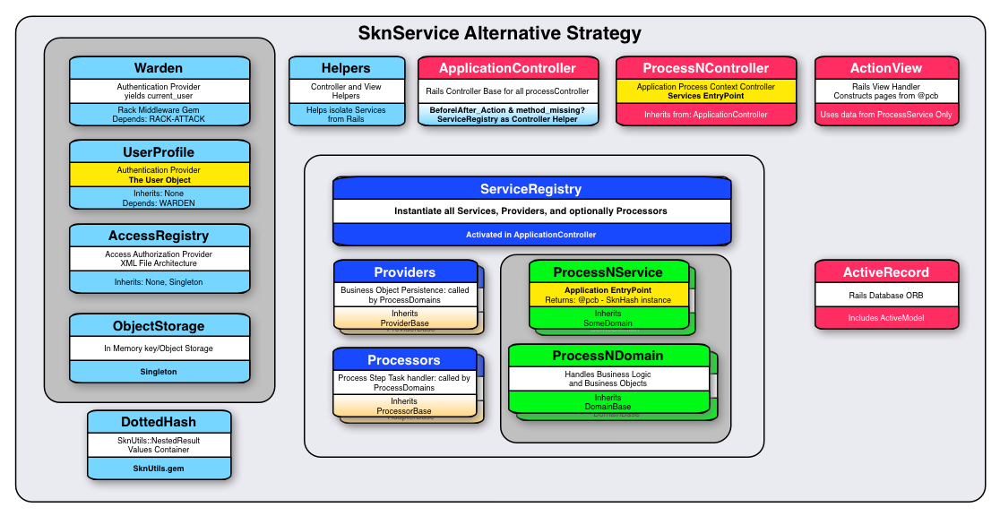

# SknService
Rails Authorization and Authentication implementation using an alternate MVC strategy.

# Introduction
This is a Rails 5, Ruby 2.3 (JRuby capable), PostgreSQL Application which demonstrates Authentication and Authorization strategies.

My original need was to demonstrate a content authorization methodology, rather than to continue open-ended theoretical discussions.  Two
implementaitons would be needed, one based on an existing XML file; modeled after Java's Security Manager and permission.  The other implementation would
be a Database driven model that represented the same goal.  It is my observation that they both meet my objective, and could both
be used successfully in any application base.  

Of the two implementation strategies the database model is my preference, as it would be easier to create a UI to support it and to maintain as new permissions are added. The demonstration
of the final algorithmic result, is the 'ContentProfile Demo' page.  It lists all the systems users, and when one is selected it displays
both the XML AccessProfile, and the matching DB ContentProfile.

The algorithm and point being made was: Create a multi-factor authorization/permission record that precisely identifies the business entities a user is assigned to, then precisely identify the
types of content that user is authorized to interact with on behalf of an assigned business entity. I.e For Account number 1104, user UUID can view Commission Document types:96033

After having proven my point, I've decided to share the body of this work and complete it by implementing a Corporate and Branch Office domain model.  The initial context of the application
was to provide protection of important business documents like commission statements, and capturing operational attributes like, which states a branch is licensed to quote new business.

Advanced security and authorization features are fully implemented and I think quite usable as a secure starter application.
  

James,

[more details](https://skoona.blogspot.com/2016/08/sknservices-alternate-development_11.html)




## Description
This application demonstrates and explores methods for Authentication, Access Authorizations,
and Content Authorizations.  Referred to as UserProfiles, AccessProfiles, and ContentProfiles in
this application.

* UserProfiles deal with userid, password, password resets, and some preferences management.
* AccessProfiles deal with what each user is allowed to access, click, or view.
* ContentProfiles deal with specific content access privileges; which document, etc. can be retrieved.
    
UserProfiles and AccessProfiles have many different implementations available, and are well handled processes. The [Java Access Controller](http://www.cs.ait.ac.th/~on/O/oreilly/java-ent/security/ch05_01.htm "Java Access Controller"), and related classes,
were the original template for the AccessRegistry or AccessProfile capability; This now is an enhanced Ruby port of those permission capabilities. However,
ContentProfiles are the main focus of exploration in this app, which has proven to be a significant 
engineering challenge when it comes to handling the dynamics of Electronic Delivery.  


### Core Idea

#### ContentProfile and AccessProfile are implementations of the same core idea, with side benefits.  For lack of a better term: ContentProfile is the label adopted to represent that core idea.
For content authorization there is an assumption that protected resources are classified and stored in some type of storage container system(SCS). An SCS might actually be a simple FileSystem or
a enterprise class document management systems.  In any event, retrieving items would require we specify some meta-data to retrieve a single document/item and different meta-data to retrieve a collection of typed documents.

I chose a FileSystem as the SCS for this demo application, so filename implies a specific instance of a thing, and filename with wildcards implies a collection of things, and the file path is identity meta-data.

Filepaths become part of the TOPIC structure, while filenames become part of the CONTENT structure. A ContentProfile entry will have both structures present.

The TOPIC structure is composed of three elements,
- topic_type:  :string           some type of business entity like a branch, agency, store, etc.
- topic_value: :array-of-strings the identifier for this entity; branch number, agency number, store number, any hard and unique reference.
- description: :string           label for this component

The CONTENT structure is composed of three elements,
- content_type:  :string           textual type of item or document; commission statement, 1099 document, budget spreadsheet, etc.
- content_value: :array-of-strings either the collection name for this type of content, or it's specific ID
- description:   :string           label for this component

The container for these two structures is defined as a ContentProfileEntry(CPE), which would be composed of these two structures and a descriptive label. CPEs are the final content authorization permission record.
  A user is considered to have permission to specific content only if a related CPE exists in their ContentProfile.

One ContentProfileEntry describes one permission, through the combination of a fully qualified content type identifiers and topic type identifiers.  It is expected that a
user's collection would have many of these specialized entries, and that some entries may be shareable (reducing redundancy) with other users.  Entries
are themselves assigned to a wrapper object called a ContentProfile which maintains a users unique collection.

ContentProfiles are the anchor back to the UserProfile, via the :person_authentication_key(PAK) or UUID they rely on as the primary identifier.

The ContentProfile collection of classes represent the database implementation of this Content Profile strategy.
The AccessProfile collection of classes represent the XML-File implementation of this Content Profile strategy as an extension to it's original role as access authorization for page views, clickables, and process access permissions.


## Installation
Application UserIDs are in the db/seed.rb file.  Developer credentials are: username: developer, passwd: developer99

You will need to install PostGreSQL, and add/edit PostgreSQL credentials an the Application-Context Configuration YAML files:

    config/settings.yml,
    config/settings/development.yml or create and edit config/settings/development.local.yml
    config/settings/test.yml or create and edit config/settings/test.local.yml

It might be helpful to set these environment params too:

    export COVERAGE=true
    export BUNDLE_PATH='vendor/bundle'     Note: use of rvm wipes out all these values, you may need to reset them

	note: demo userids are documented in the seeds.rb file.


Then execute;

```Bash

$ mkdir tmp
$ bin/setup
$ rspec

$ bundle exec rails server Puma -b 0.0.0.0

```


    Also: db/seeds.rb contains test user credentials
          lib/tasks/profile_tools_task.rake creates the initial database version of the content profile, during 'bin/setup'


## Contributing
1. Fork it
2. Create your feature branch (`git checkout -b my-new-feature`)
3. Commit your changes (`git commit -am 'Add some feature'`)
4. Push to the branch (`git push origin my-new-feature`)
5. Create new Pull Request

        
## License


Copyright (c) 2015-2016 James Scott, Jr.

Permission is hereby granted, free of charge, to any person obtaining a copy of this software and associated documentation files (the "Software"), to deal in the Software without restriction, including without limitation the rights to use, copy, modify, merge, publish, distribute, sublicense, and/or sell copies of the Software, and to permit persons to whom the Software is furnished to do so, subject to the following conditions:

The above copyright notice and this permission notice shall be included in all copies or substantial portions of the Software.

THE SOFTWARE IS PROVIDED "AS IS", WITHOUT WARRANTY OF ANY KIND, EXPRESS OR IMPLIED, INCLUDING BUT NOT LIMITED TO THE WARRANTIES OF MERCHANTABILITY, FITNESS FOR A PARTICULAR PURPOSE AND NONINFRINGEMENT. IN NO EVENT SHALL THE AUTHORS OR COPYRIGHT HOLDERS BE LIABLE FOR ANY CLAIM, DAMAGES OR OTHER LIABILITY, WHETHER IN AN ACTION OF CONTRACT, TORT OR OTHERWISE, ARISING FROM, OUT OF OR IN CONNECTION WITH THE SOFTWARE OR THE USE OR OTHER DEALINGS IN THE SOFTWARE.
   
